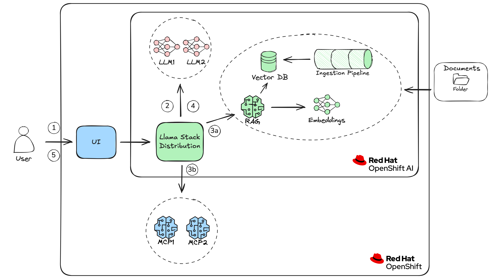

# Llama Stack Demo

Welcome to the Llama Stack Demo for Red Hat OpenShift AI (RHOAI). This comprehensive demo deploys everything you need to test AI agents with MCP tools on RHOAI using Llama Stack:

- **Models**: Llama 3.1 8B (quantized w4a16) deployed using vLLM Serving Runtime and automatically registered in Llama Stack
- **MCP Servers**: Rust-based MCP servers deployed as standard deployments and automatically configured in Llama Stack
- **Llama Stack Server**: Deployed using the **Llama Stack Operator** (included in RHOAI) via the `LlamaStackDistribution` Custom Resource
- **Vector Databases**: Support for Milvus (inline and remote) and PostgreSQL with pgvector
- **RAG Pipelines**: Automated document ingestion using Kubeflow Pipelines (DSPA)

## Table of Contents

- [Overview](#overview)
- [Architecture](#architecture)
- [Components](#components)
- [Requirements](#requirements)
- [Installation](#installation)
- [Configuration](#configuration)
- [Usage](#usage)
- [Business Rules](#business-rules)
- [Uninstall](#uninstall)
- [Monitoring](#monitoring)

## Overview

The Eligibility Assessment System is powered by Llama Stack and Model Context Protocol (MCP). It helps assess eligibility for Family Care Unpaid Leave Support based on the Republic of Lysmark's Act No. 2025/47-SA.

The system combines Llama Stack with MCP servers and Retrieval Augmented Generation (RAG) to provide accurate, context-aware assessments for:

- Care for sick/injured family members
- Childcare for multiple children
- Adoption cases
- Single-parent family scenarios

### What Gets Deployed

The Helm chart deploys:

- **LlamaStackDistribution CR**: Processed by the Llama Stack Operator to create a fully configured Llama Stack server with all providers
- **Streamlit Application**: Interactive UI for eligibility consultations (`{app}-app`)
- **FastAPI Server**: REST API for programmatic access (`{app}-api`)
- **MCP Servers**: Eligibility Engine, Compatibility Engine, Cluster Insights, Finance Engine
- **Vector Databases**: Milvus (with Attu UI) and/or PostgreSQL (with CloudBeaver UI)
- **Models**: Llama 3.1 8B via KServe InferenceService (using vLLM runtime)
- **Kubeflow Pipelines**: DSPA for automated document ingestion (optional)

## Architecture



### References

- [Llama Stack Documentation](https://llama-stack.readthedocs.io/en/latest/)
- [Model Context Protocol (MCP)](https://spec.modelcontextprotocol.io/)
- [Eligibility Engine MCP Server](https://github.com/alpha-hack-program/eligibility-engine-mcp-rs)
- [Compatibility Engine MCP Server](https://github.com/alpha-hack-program/compatibility-engine-mcp-rs)
- [Cluster Insights MCP Server](https://github.com/alpha-hack-program/cluster-insights-mcp-rs)
- [Finance Engine MCP Server](https://github.com/alpha-hack-program/finance-engine-mcp-rs)

## Components

### Vector Databases

The system supports multiple vector database configurations for RAG capabilities:

#### Milvus Inline

Llama Stack's built-in Milvus provider stores vectors locally using a file-based database (`/tmp/milvus.db`). This is always available as the `milvus` provider.

- **Use case**: Development, testing, single-instance deployments
- **Provider ID**: `milvus`

#### Milvus Remote (Standalone)

When `milvus.deploy: true`, the chart deploys a standalone Milvus instance:

| Component | Description |
|-----------|-------------|
| **etcd** | Distributed key-value store for Milvus metadata |
| **milvus-standalone** | Milvus vector database server |
| **Attu** | Web-based Milvus management UI |

When `milvus.enableRemote: true`, the `remote::milvus` provider (`milvus-remote`) is configured in Llama Stack.

- **Use case**: Production deployments, persistent vector storage
- **Provider ID**: `milvus-remote`

#### pgvector (PostgreSQL)

When `postgres.deploy: true`, the chart deploys PostgreSQL with pgvector:

| Component | Description |
|-----------|-------------|
| **PostgreSQL** | Database with pgvector extension (image: `pgvector/pgvector:pg16`) |
| **CloudBeaver** | Web-based database management UI |

When `postgres.enablePgVector: true`, the `remote::pgvector` provider is configured in Llama Stack.

- **Use case**: Teams using PostgreSQL, simpler operational model
- **Provider ID**: `pgvector`

### MCP Servers

The default configuration includes four MCP servers:

| Server | Description | Repository |
|--------|-------------|------------|
| **eligibility-engine** | Evaluates unpaid leave eligibility | [eligibility-engine-mcp-rs](https://github.com/alpha-hack-program/eligibility-engine-mcp-rs) |
| **compatibility-engine** | Checks compatibility requirements | [compatibility-engine-mcp-rs](https://github.com/alpha-hack-program/compatibility-engine-mcp-rs) |
| **cluster-insights** | Provides OpenShift cluster information | [cluster-insights-mcp-rs](https://github.com/alpha-hack-program/cluster-insights-mcp-rs) |
| **finance-engine** | Financial calculations and data | [finance-engine-mcp-rs](https://github.com/alpha-hack-program/finance-engine-mcp-rs) |

All MCP servers use the `streamable-http` transport protocol.

### Embedding Model

The system uses **Sentence Transformers** with the `nomic-ai/nomic-embed-text-v1.5` model:

- **Vector Dimension**: 768
- **Chunk Size**: 800 tokens
- **Chunk Overlap**: 400 tokens

### Kubeflow Pipelines (DSPA)

When `pipelines.enabled: true`, the chart deploys:

- **DataSciencePipelinesApplication (DSPA)**: Pipeline orchestration platform
- **Pipeline Upserter Hook**: Imports RAG pipeline definitions from Git
- **Pipeline Runner Hook**: Creates pipeline runs for each vector store provider

## Requirements

### Hardware Requirements

**Recommended:**
- **GPU**: 1x NVIDIA A10G or equivalent
- **CPU**: 8 cores
- **Memory**: 24 Gi
- **Storage**: 20 Gi

**Minimum:**
- **GPU**: 1x NVIDIA GPU (shared allocation supported)
- **CPU**: 6 cores
- **Memory**: 16 Gi
- **Storage**: 10 Gi

The default configuration uses the quantized Llama 3.1 8B model (`w4a16`) for efficient GPU utilization.

### Software Requirements

- **Red Hat OpenShift**: 4.20+ (tested on 4.20)
- **Red Hat OpenShift AI**: 3.2+ (tested on 3.2)
  - Includes the **Llama Stack Operator** which manages `LlamaStackDistribution` Custom Resources
- **OpenShift Service Mesh**: Required for KServe
- **OpenShift Serverless**: Required for KServe

#### Llama Stack Operator

The Llama Stack Operator is a component of Red Hat OpenShift AI that simplifies the deployment and management of Llama Stack distributions. It introduces the `LlamaStackDistribution` Custom Resource (CR) which allows you to declaratively configure:

- Llama Stack server configuration
- Model providers and endpoints
- Vector database providers (Milvus, pgvector)
- MCP server integrations
- Telemetry and monitoring settings

The Helm chart creates a `LlamaStackDistribution` CR that the operator reconciles into a fully configured Llama Stack deployment.

### Minio (Required for Pipelines)

If using Kubeflow Pipelines (`pipelines.enabled: true`), Minio must be installed in the `minio` namespace.

**Verify Minio is available:**

```bash
oc get svc minio -n minio
```

Expected output:

```
NAME    TYPE        CLUSTER-IP      EXTERNAL-IP   PORT(S)    AGE
minio   ClusterIP   172.30.x.x      <none>        9000/TCP   1d
```

**Default Minio Configuration:**
- **Service**: `minio.minio.svc`
- **Port**: `9000`
- **Access Key**: `minio`
- **Secret Key**: `minio123`
- **Bucket**: `pipelines`

### Node Labels

At least one GPU-enabled worker node must have this label:

```yaml
group: llama-stack-demo
```

## Installation

### Clone the Repository

```bash
git clone https://github.com/alpha-hack-program/llama-stack-demo.git
cd llama-stack-demo
```

### Log in to OpenShift

```bash
oc login --server=<your-cluster-api> --token=<your-token>
```

### Create the Project

```bash
PROJECT="llama-stack-demo"
oc new-project ${PROJECT}
```

Label the project for OpenShift AI:

```bash
oc label namespace ${PROJECT} modelmesh-enabled=false opendatahub.io/dashboard=true
```

### Install with Helm

**Default deployment (NVIDIA GPU with Llama 3.1 8B):**

```bash
helm install llama-stack-demo helm/ --namespace ${PROJECT} --timeout 20m
```

**With secrets file (for remote models with API keys):**

```bash
helm install llama-stack-demo helm/ -f helm/values-secrets.yaml --namespace ${PROJECT} --timeout 20m
```

**Intel Gaudi deployment:**

```bash
helm install llama-stack-demo helm/ --values helm/intel.yaml --namespace ${PROJECT} --timeout 20m
```

**NVIDIA deployment with different models:**

```bash
helm install llama-stack-demo helm/ --values helm/nvidia.yaml --namespace ${PROJECT} --timeout 20m
```

### Wait for Pods

```bash
oc -n ${PROJECT} get pods -w
```

Expected pods (5-10 minutes to start):

```
NAME                                              READY   STATUS    RESTARTS   AGE
llama-stack-demo-0                                1/1     Running   0          8m
llama-stack-demo-app-xxxxx                        1/1     Running   0          8m
llama-stack-demo-api-xxxxx                        1/1     Running   0          8m
eligibility-engine-xxxxx                          1/1     Running   0          7m
compatibility-engine-xxxxx                        1/1     Running   0          7m
cluster-insights-xxxxx                            1/1     Running   0          7m
finance-engine-xxxxx                              1/1     Running   0          7m
milvus-standalone-xxxxx                           1/1     Running   0          6m
etcd-deployment-xxxxx                             1/1     Running   0          6m
attu-xxxxx                                        1/1     Running   0          6m
pg-lsd-xxxxx                                      1/1     Running   0          6m
cloudbeaver-xxxxx                                 1/1     Running   0          6m
llama-3-1-8b-w4a16-predictor-xxxxx               2/2     Running   0          10m
```

## Configuration

### Vector Database Configuration

#### Milvus Settings

| Parameter | Description | Default |
|-----------|-------------|---------|
| `milvus.deploy` | Deploy Milvus infrastructure | `true` |
| `milvus.enableRemote` | Enable `milvus-remote` provider | `true` |
| `milvus.host` | Milvus service hostname | `milvus-service` |
| `milvus.port` | Milvus gRPC port | `19530` |
| `milvus.storage` | PVC storage size | `20Gi` |
| `milvus.image` | Milvus image | `milvusdb/milvus:v2.6.0` |

**Examples:**

```bash
# Deploy Milvus with remote provider
helm install llama-stack-demo helm/ \
  --set milvus.deploy=true \
  --set milvus.enableRemote=true \
  --namespace ${PROJECT}

# Use only inline Milvus (no deployment)
helm install llama-stack-demo helm/ \
  --set milvus.deploy=false \
  --set milvus.enableRemote=false \
  --namespace ${PROJECT}

# Connect to external Milvus
helm install llama-stack-demo helm/ \
  --set milvus.deploy=false \
  --set milvus.enableRemote=true \
  --set milvus.host=external-milvus.example.com \
  --set milvus.token=your-token \
  --namespace ${PROJECT}
```

#### PostgreSQL/pgvector Settings

| Parameter | Description | Default |
|-----------|-------------|---------|
| `postgres.deploy` | Deploy PostgreSQL with pgvector | `true` |
| `postgres.enablePgVector` | Enable `pgvector` provider | `true` |
| `postgres.host` | PostgreSQL hostname | `pg-lsd-service` |
| `postgres.port` | PostgreSQL port | `5432` |
| `postgres.user` | Database username | `llamastack` |
| `postgres.password` | Database password | `llamastack` |
| `postgres.db` | Database name | `llamastack` |

**Examples:**

```bash
# Deploy PostgreSQL with pgvector
helm install llama-stack-demo helm/ \
  --set postgres.deploy=true \
  --set postgres.enablePgVector=true \
  --namespace ${PROJECT}

# Disable PostgreSQL entirely
helm install llama-stack-demo helm/ \
  --set postgres.deploy=false \
  --set postgres.enablePgVector=false \
  --namespace ${PROJECT}

# Connect to external PostgreSQL
helm install llama-stack-demo helm/ \
  --set postgres.deploy=false \
  --set postgres.enablePgVector=true \
  --set postgres.host=external-postgres.example.com \
  --set postgres.user=myuser \
  --set postgres.password=mypassword \
  --namespace ${PROJECT}
```

### Kubeflow Pipelines Configuration

| Parameter | Description | Default |
|-----------|-------------|---------|
| `pipelines.enabled` | Enable DSPA deployment | `true` |
| `pipelines.connection.host` | Minio host | `minio.minio.svc` |
| `pipelines.connection.port` | Minio port | `9000` |
| `pipelines.connection.awsS3Bucket` | S3 bucket | `pipelines` |
| `pipelines.runner.vectorStoreProviderIds` | Vector stores to populate | `milvus, milvus-remote, pgvector` |
| `pipelines.healthCheck.maxRetries` | Max health check attempts | `30` |
| `pipelines.healthCheck.delay` | Delay between retries (seconds) | `10` |

**Examples:**

```bash
# Enable pipelines for all vector stores
helm install llama-stack-demo helm/ \
  --set pipelines.enabled=true \
  --set pipelines.runner.vectorStoreProviderIds="milvus,milvus-remote,pgvector" \
  --namespace ${PROJECT}

# Disable pipelines
helm install llama-stack-demo helm/ \
  --set pipelines.enabled=false \
  --namespace ${PROJECT}

# Run pipelines only for pgvector
helm install llama-stack-demo helm/ \
  --set pipelines.enabled=true \
  --set pipelines.runner.vectorStoreProviderIds="pgvector" \
  --namespace ${PROJECT}
```

#### Pipeline Hooks

When `pipelines.enabled: true`, these Helm hooks execute during `post-install` and `post-upgrade`:

1. **Pipeline Upserter Hook** (weight: 4)
   - Clones pipeline definitions from Git repository
   - Compiles and uploads pipelines to DSPA
   - Uses `uv` package manager for dependencies

2. **Pipeline Runner Hook** (weight: 5)
   - Creates a pipeline run for each vector store provider in `vectorStoreProviderIds`
   - Ingests documents from the configured Git repository
   - Configurable parameters: `gitRepo`, `gitContext`, `filenames`, `vectorStoreName`, `embeddingModel`, `chunkSizeInTokens`, `chunkOverlapInTokens`

## Usage

### Access the System

#### Streamlit Application

```bash
oc get route ${PROJECT}-app -n ${PROJECT} -o jsonpath='{.spec.host}'
```

Open the URL in your browser for the interactive eligibility assessment interface.

#### REST API

```bash
oc get route ${PROJECT}-api -n ${PROJECT} -o jsonpath='{.spec.host}'
```

Use this endpoint for programmatic access.

#### Llama Stack API

```bash
oc get route ${PROJECT}-route -n ${PROJECT} -o jsonpath='{.spec.host}'
```

Direct access to the Llama Stack API.

#### OpenShift AI Dashboard

```bash
oc get route rhods-dashboard -n redhat-ods-applications -o jsonpath='{.spec.host}'
```

Navigate to **Data Science Projects** → **llama-stack-demo** to see deployed models and workbenches.

#### Database UIs

- **Attu (Milvus)**: `oc get route attu -n ${PROJECT} -o jsonpath='{.spec.host}'`
- **CloudBeaver (PostgreSQL)**: `oc get route cloudbeaver -n ${PROJECT} -o jsonpath='{.spec.host}'`

### Example Queries

- "My mother had an accident and she's at the hospital. I have to take care of her, can I get access to the unpaid leave aid?"
- "I have just adopted two children, at the same time, aged 3 and 5, am I eligible for the unpaid leave aid? How much?"
- "I'm a single mom and I just had a baby, may I get access to the unpaid leave aid?"
- "Enumerate the legal requirements to get the aid for unpaid leave."

### Example System Prompt

```
You are a helpful AI assistant that uses tools to help citizens of the Republic of Lysmark. Answers should be concise and human readable. AVOID references to tools or function calling nor show any JSON. Infer parameters for function calls or instead use default values or request the needed information from the user. Call the RAG tool first if unsure. Parameter single_parent_family only is necessary if birth/adoption/foster_care otherwise use false.
```

## Business Rules

### Unpaid Leave Evaluation Cases

| Case | Situation | Monthly Benefit | Description |
|------|-----------|-----------------|-------------|
| **A** | Illness/accident | 725€ | First-degree family care for sick or accident victim |
| **B** | Third child or more | 500€ | Birth with 3+ children (at least 2 under 6 years) |
| **C** | Adoption/foster care | 500€ | Adoption or foster care (>1 year duration) |
| **D** | Multiple birth/adoption | 500€ | Multiple delivery, adoption, or foster care |
| **E** | Single-parent family | 500€ | Single-parent family with newborn |
| **NONE** | Not eligible | 0€ | Requirements not met |

### Eligibility Requirements

- Must have first-degree family relationship (father, mother, son, daughter, spouse, partner)
- Situation must match one of the covered cases
- Documentation requirements vary by case

## Uninstall

### Remove the Helm Release

```bash
helm uninstall llama-stack-demo --namespace ${PROJECT}
```

### Clean Up Remaining Resources

```bash
oc delete jobs -l "app.kubernetes.io/part-of=llama-stack-demo" -n ${PROJECT}
```

### Delete the Project

```bash
oc delete project ${PROJECT}
```

## Monitoring

### Enable OpenTelemetry Tracing

The system supports OpenTelemetry tracing when `otelCollector.enabled: true`. Configure your DSCInitialization:

```yaml
apiVersion: dscinitialization.opendatahub.io/v2
kind: DSCInitialization
metadata:
  name: default-dsci
spec:
  monitoring:
    managementState: Managed
    metrics:
      replicas: 1
      storage:
        retention: 90d
        size: 50Gi
    namespace: redhat-ods-monitoring
    traces:
      sampleRatio: '1.0'
      storage:
        backend: pv
        retention: 2160h0m0s
        size: 100Gi
```

### Collector Service (Workaround)

If the collector service is missing, create it:

```yaml
apiVersion: v1
kind: Service
metadata:
  name: data-science-collector
  namespace: redhat-ods-monitoring
  labels:
    app.kubernetes.io/component: opentelemetry-collector
    app.kubernetes.io/instance: redhat-ods-monitoring.data-science-collector
    app.kubernetes.io/part-of: opentelemetry
spec:
  ports:
    - name: otlp-grpc
      port: 4317
      targetPort: 4317
      protocol: TCP
      appProtocol: grpc
    - name: otlp-http
      port: 4318
      targetPort: 4318
      protocol: TCP
      appProtocol: http
    - name: prometheus
      port: 8889
      targetPort: 8889
      protocol: TCP
  selector:
    app.kubernetes.io/component: opentelemetry-collector
    app.kubernetes.io/instance: redhat-ods-monitoring.data-science-collector
    app.kubernetes.io/managed-by: opentelemetry-operator
    app.kubernetes.io/part-of: opentelemetry
  type: ClusterIP
```

---

## Development Notes

### Trip Report

The inner to outer development loop:
1. Decision table design
2. Code implementation
3. Unit testing
4. MCP Inspector validation
5. Claude Desktop testing
6. Llama Stack Local with RHOAI models
7. Llama Stack on RHOAI

Key learnings:
- Started with TypeScript MCP server, switched to Rust for better performance
- Simplified logic from full legal document coverage to decision table approach
- Variable naming (e.g., `is_single_parent_family`, `number_of_children_after`) significantly impacts SLM performance
